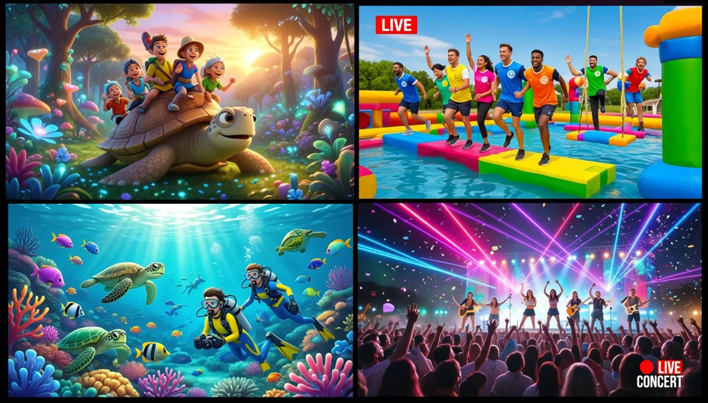
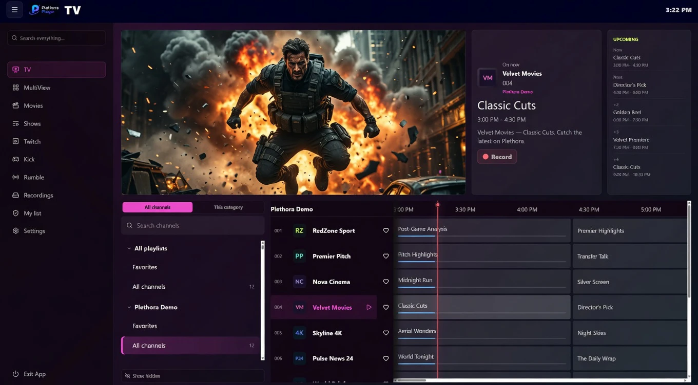
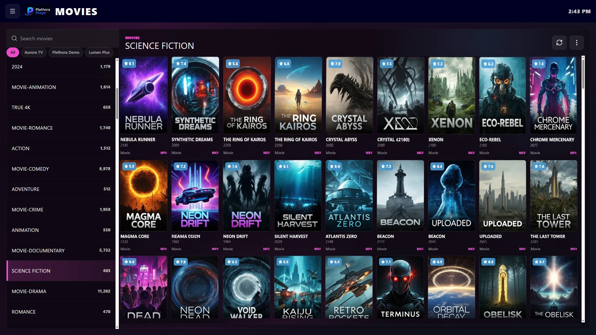
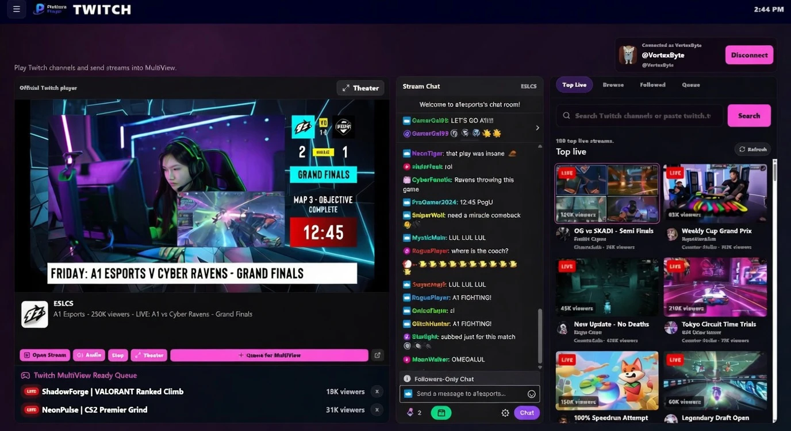
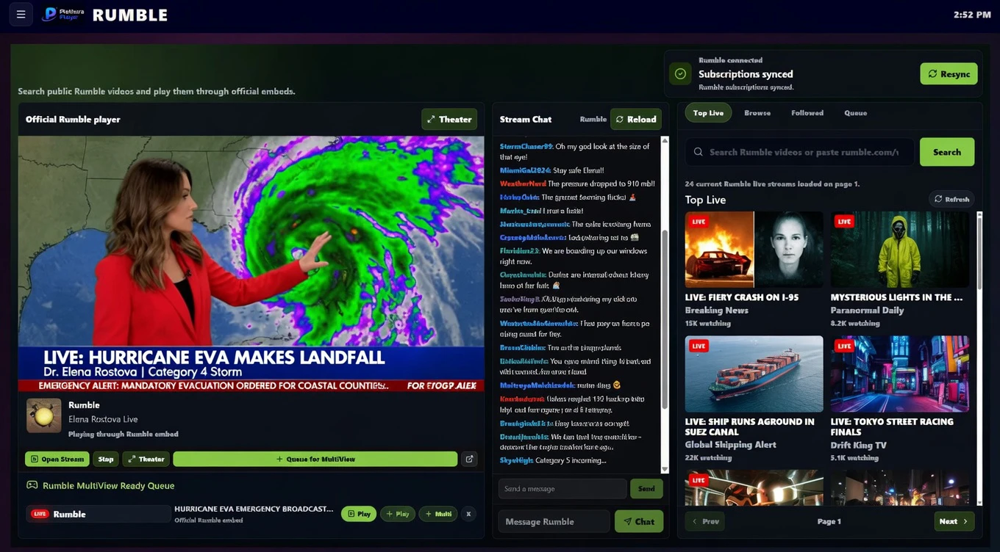
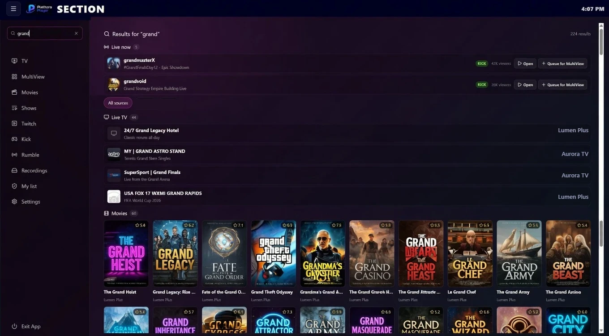
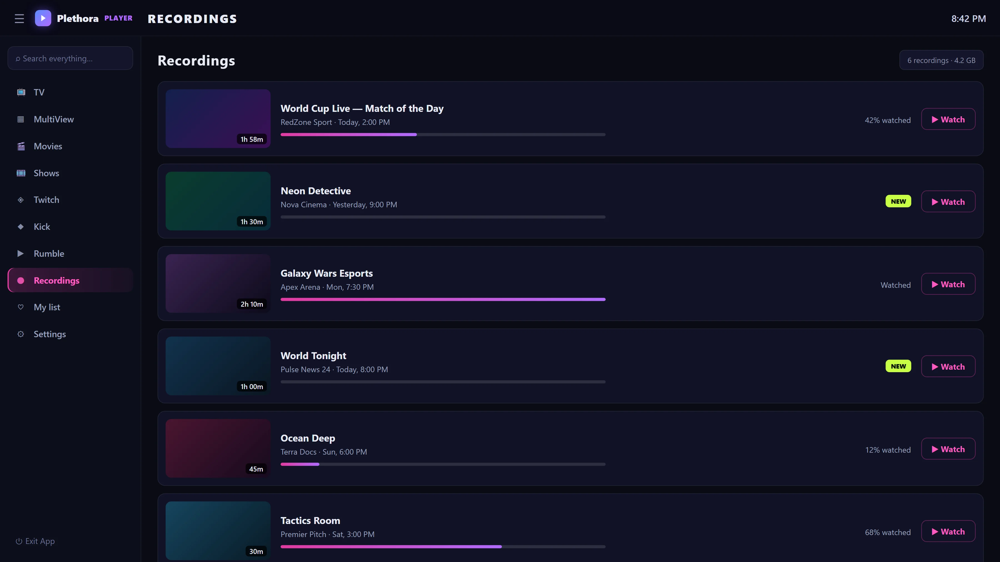
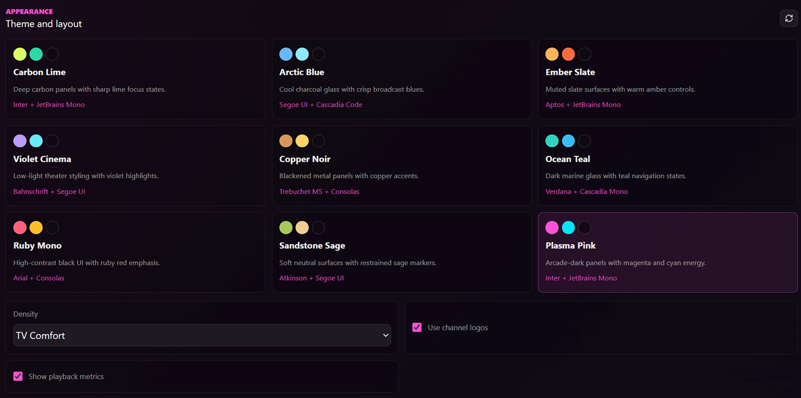

# Plethora Player

**📺 Live TV · 🎬 Movies &amp; Series · 🟣 Twitch · 🟢 Kick · 🔴 Rumble — all in one blazing-fast Windows player.**

  

&nbsp;&nbsp;

  

&nbsp;

&nbsp;

&nbsp;

---

## ⚡ What is Plethora Player?

Plethora Player is a **fast, native Windows app** that brings everything you watch into one beautiful place — your **IPTV / Xtream** playlists (Live TV, Movies &amp; Series with a full program guide), plus **Twitch, Kick &amp; Rumble** built right in. Watch up to **four streams at once** in MultiView, **pause · rewind · snap back to live** with full DVR, and search your entire library instantly.

Built on **Rust + Tauri** with hardware-accelerated **mpv (Direct3D 11)** video — it launches fast, stays light, and plays buttery-smooth.

> 🎒 **Bring your own playlist — we bring the player.** Plethora is a *player*. It does not provide, include, or resell any channels, streams, or subscriptions.

---

## 🎬 See it in action

### 🔲 MultiView — up to four streams at once, across providers

<table>
<tr>
<td width="50%"> <b>📺 Live TV with a full program guide (EPG)</b></td>
<td width="50%"> <b>🎬 Movies &amp; Series with rich metadata</b></td>
</tr>
<tr>
<td> <b>🟣 Twitch — with chat, right in the app</b></td>
<td> <b>🔴 Rumble &amp; 🟢 Kick — built in</b></td>
</tr>
<tr>
<td> <b>🔍 Universal search across everything</b></td>
<td> <b>⏺ Record &amp; timeshift live TV</b></td>
</tr>
</table>

---

## ✨ Features

<table>
<tr>
<td width="50%" valign="top">

📺 **Live TV** — M3U / M3U8 &amp; Xtream playlists, XMLTV guide, favorites, channel search

⏪ **DVR &amp; Timeshift** — pause, rewind, fast-forward, and jump back to live on any channel

🎬 **Movies &amp; Series** — browse and play your VOD library with posters, cast &amp; details

🔍 **Universal search** — find channels, movies, shows, cast &amp; directors instantly

</td>
<td width="50%" valign="top">

🔲 **MultiView** — up to 4 streams at once, mix IPTV + Twitch + Kick + Rumble, PiP

🟣🟢🔴 **Twitch · Kick · Rumble** — browse, watch &amp; chat without leaving the app

🎨 **Themes** — make it yours with built-in color themes

⚡ **Native &amp; fast** — Rust + Tauri + mpv (D3D11) hardware-accelerated video

</td>
</tr>
</table>

---

## 📥 Download &amp; install

<table>
<tr>
<td width="50%" align="center" valign="top">

### 🛒 Microsoft Store &nbsp;·&nbsp; *recommended*

Auto-updates in the background · no security prompts

</td>
<td width="50%" align="center" valign="top">

### 💾 Direct download

Windows 10 / 11 · 64-bit · ~94 MB

**[⬇ Download the installer](https://plethoraplayer.com/download)**

SHA-256 published on the download page for verification

</td>
</tr>
</table>

---

## 💎 Free vs Premium

| | Free | Premium |
|---|:---:|:---:|
| Live TV, Movies &amp; Series | ✅ | ✅ |
| Twitch · Kick · Rumble | ✅ | ✅ |
| Playlists / sources | 1 | ♾️ Unlimited |
| MultiView | 2 screens | 4 screens |
| Universal search | — | ✅ |
| Record live TV | — | ✅ |
| Pause &amp; rewind live TV | — | ✅ |
| Devices per account | — | Up to 5 |

Start free, then unlock everything at **[plethoraplayer.com](https://plethoraplayer.com/pricing)** — a free trial is available.

---

## 🔄 Updates

- **Microsoft Store installs** update automatically through the Store — nothing to do.
- **Direct installs** update themselves: **Settings → About → Check for updates**.

---

## 💻 System requirements

| | |
| --- | --- |
| **OS** | Windows 10 / 11 (64-bit) |
| **Graphics** | Any Direct3D 11–capable GPU |
| **Memory** | 4 GB RAM minimum · 8 GB+ recommended |

---

## 🐛 Feedback &amp; support

Found a bug or have an idea? Report it right inside the app — **Settings → Report a Bug** (logs &amp; system info attach automatically) — or email **[support@plethoraplayer.com](mailto:support@plethoraplayer.com)**.

---

  

© 2026 Plethora Player · <a href="https://plethoraplayer.com">plethoraplayer.com</a> 
Not affiliated with, endorsed by, or associated with any IPTV service or content provider. Plethora Player does not provide or supply any channels, streams, or subscriptions.

